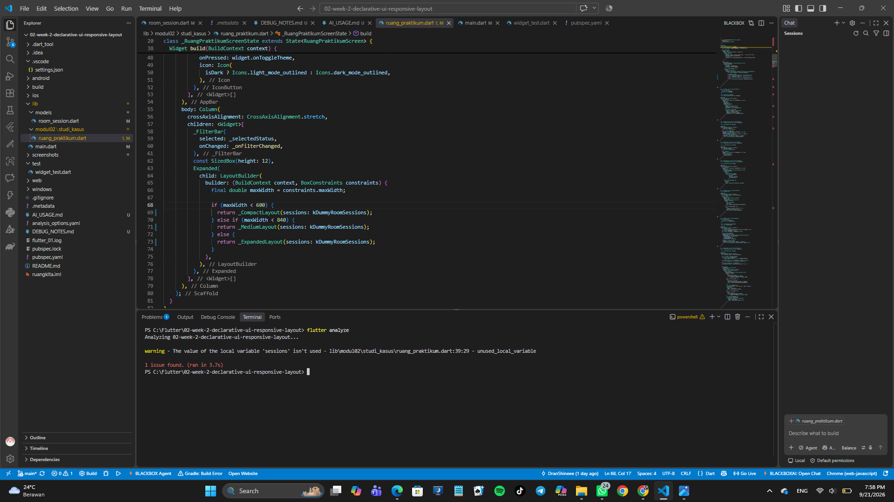
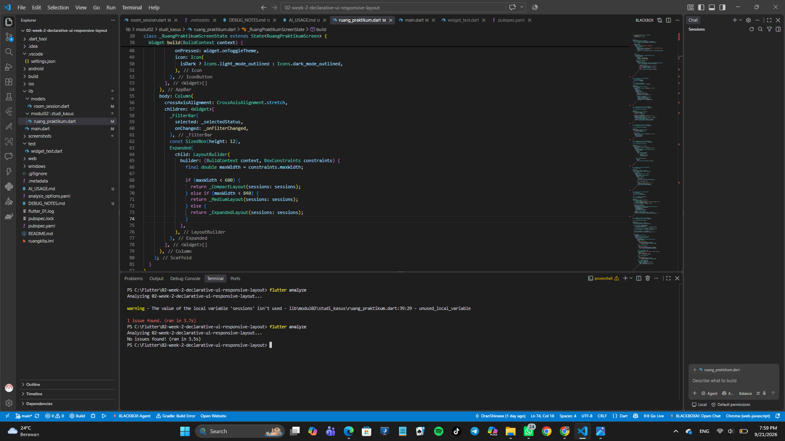
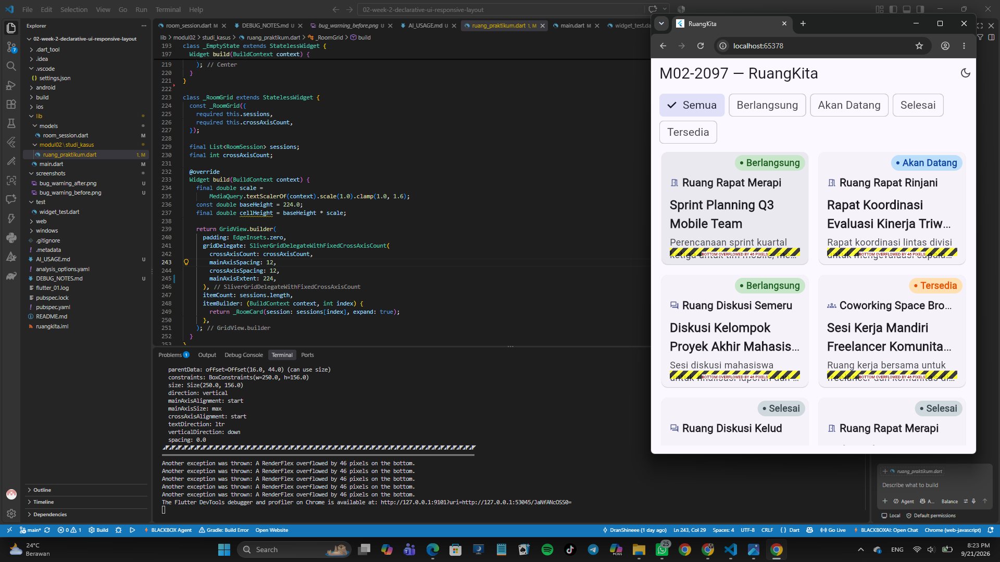
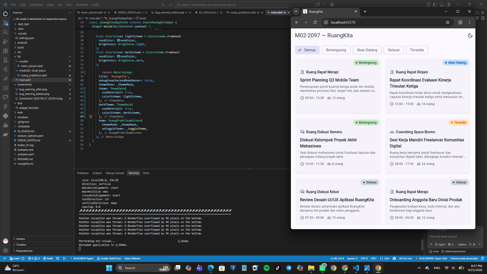

# DEBUG_NOTES.md

Nama  : Khairan Adiokta Arun Nugraha  
NIM   : 362558302097  
Kode  : M02-2097  

---

**Bug 1 — Warning unused variable `sessions` (analyzer)**

Waktu saya menjalankan `flutter analyze` di Sesi 3, muncul warning:
"The value of the local variable 'sessions' isn't used" di
lib\modul02\studi_kasus\ruang_praktikum.dart baris 42. Aplikasi sih
tetap jalan, tapi warning-nya ganggu dan ternyata ini bukan warning
biasa — nanti filter status gak akan ngefek kalau dibiarin.

Bukti sebelum: 

Penyebabnya, di `_RuangPraktikumScreenState.build` aku hitung `sessions`
dari `_visibleSessions`, tapi ketiga layout (compact, medium, expanded)
masih memanggil `kDummyRoomSessions` langsung. Jadi variabel `sessions`
tidak terpakai, dan nanti filter tidak nyambung ke UI.

Perbaikannya hanya mengganti pemanggilan layout agar menerima
`sessions`. Dari `return const _CompactLayout();` jadi
`return _CompactLayout(sessions: sessions);`. Hapus juga `const` di
depannya karena `sessions` runtime. Sama juga buat medium dan expanded.

Bukti sesudah: 

Hasilnya, `flutter analyze` jadi bersih. Filter "Berlangsung" di Sesi 4
juga jalan, card tinggal 2 (RS-001 sama RS-003).

**Bug 2 — Card overflow waktu text scale besar (layout / constraints)**

Waktu saya tes pakai text scale 1.5x,
card di layout medium (720x1024) dan expanded (1024x800) muncul strip
kuning-hitam di bawahnya. Console Chrome bilang:
"A RenderFlex overflowed by 42 pixels on the bottom." Compact (360x800)
aman, karena pakai ListView jadi tingginya mengikuti isi.

Bukti sebelum: 

Penyebabnya, di `_RoomGrid` saya set `mainAxisExtent: 224` (fix). Waktu
text scale naik, isi card jadi lebih tinggi, tapi tinggi slot gridnya
tetep 224. Jadi Column di dalam card kehabisan ruang, jadi overflow.

Perbaikannya, bikin tinggi cell-nya mengikuti text scale. Dari yang
awalnya `mainAxisExtent: 224`, jadi:

  final double scale =
      MediaQuery.textScalerOf(context).scale(1.0).clamp(1.0, 1.6);
  final double cellHeight = 224.0 * scale;
  // lalu dipakai: mainAxisExtent: cellHeight,

`const` di depannya dihapus karena udah runtime. saya sengaja tidak
mengurangi teks atau hapus info apapun, cuma tinggi cellnya yang diubah.

Bukti sesudah: 

Hasilnya, kwtika dirun di 360x800, 720x1024, 1024x800 memakai text scale 1.5,
tidak ada strip kuning-hitam lagi. Text scale normal juga aman.
