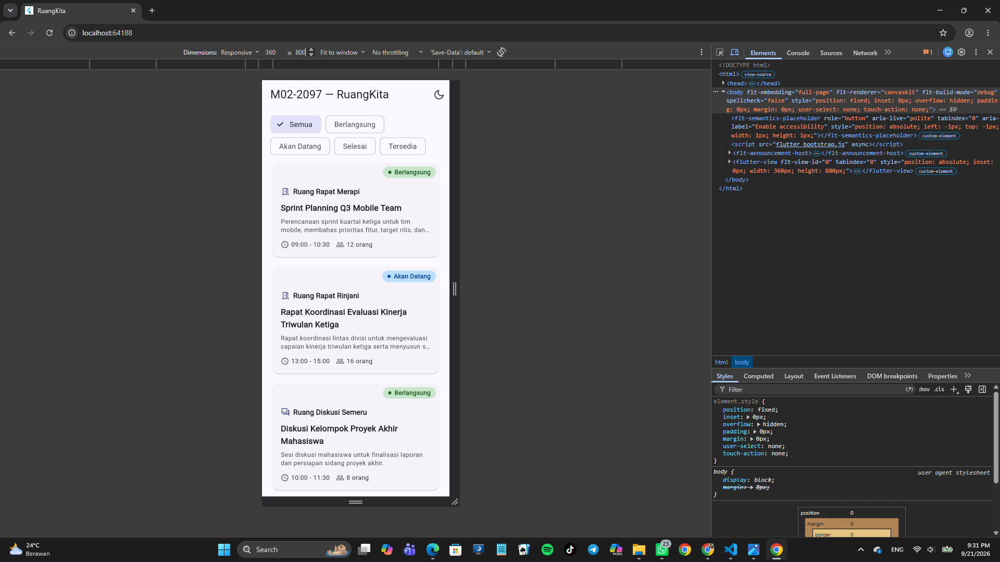
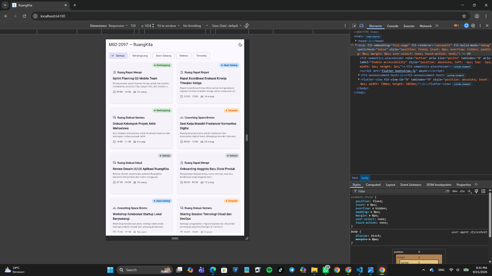
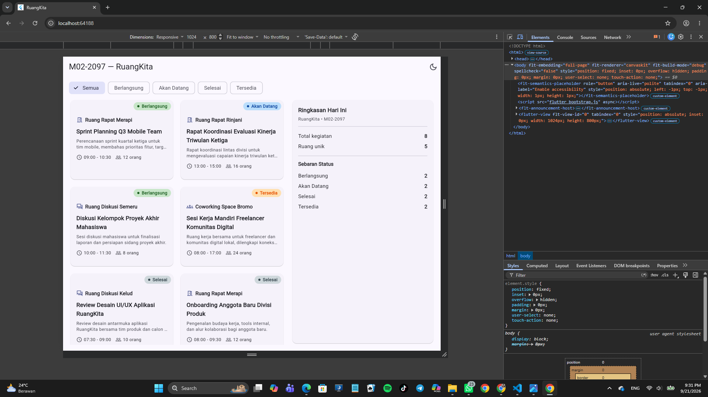
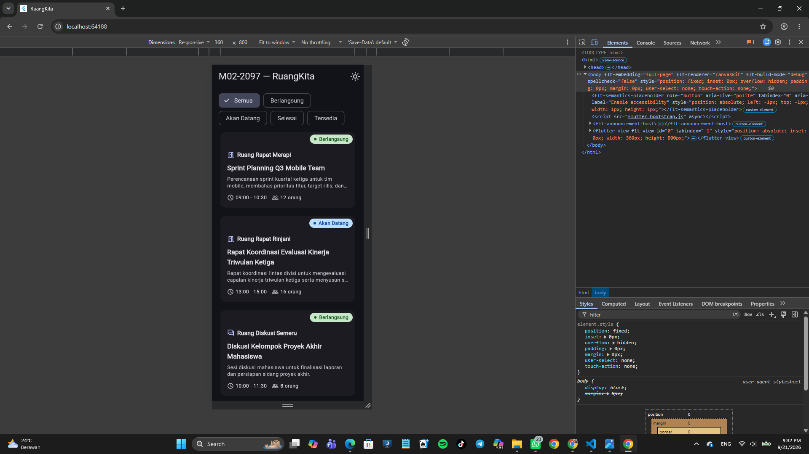

# RuangKita — Dashboard Ketersediaan Ruang

Tugas Rumah Modul 02 — Declarative UI & Responsive Layout  
Pemrograman Perangkat Bergerak  

Nama  : Khairan Adiokta Arun Nugraha  
NIM   : 362558302097  
Kode  : M02-2097  
Varian: Ruang Rapat & Coworking   

---

## Apakah ini?

RuangKita itu satu halaman Flutter buat nampilin status penggunaan
ruang rapat, ruang diskusi, dan coworking hari ini. Ada 8 data dummy,
5 nama ruang beda, dan 4 status: Berlangsung, Akan Datang, Selesai,
Tersedia.

Fitur yang ada:
- Card per sesi ruang (nama ruang, kegiatan, deskripsi, waktu,
  kapasitas, badge status)
- Filter status memakai ChoiceChip
- Tap card buka bottom sheet detail + ada switch "Ingatkan saya"
- Responsif 3 kelas lebar (compact / medium / expanded)
- Light & Dark Mode

---

## Struktur file

  lib/  
  ├── main.dart  
  ├── models/  
  │   └── room_session.dart  
  └── modul02/  
      └── studi_kasus/  
          └── ruang_praktikum.dart  
  screenshots/  
  ├── 01_mobile_light.png  
  ├── 02_tablet.png  
  ├── 03_expanded.png  
  └── 04_dark_mode.png  

---

## Arsitektur widget

Data dipisah dari UI. Model `RoomSession` + list `kDummyRoomSessions`
ada di `models/room_session.dart`. UI-nya di `ruang_praktikum.dart`.

Alur widget utama:

  MaterialApp  
  └── RuangPraktikumScreen (StatefulWidget)  
      └── Scaffold  
          ├── AppBar (judul M02-2097 + tombol toggle tema)  
          └── Column  
              ├── _FilterBar (Wrap + ChoiceChip)  
              └── Expanded → LayoutBuilder  
                  ├── < 600 dp  → _CompactLayout (ListView)  
                  ├── 600-839   → _MediumLayout (GridView 2 kolom)  
                  └── >= 840    → _ExpandedLayout (grid + panel ringkasan)  

Setiap card:

  Stack  
  ├── Card → InkWell → Padding → Column  
  │   ├── Row (ikon + Expanded nama ruang)  
  │   ├── Text kegiatan (maxLines 2, ellipsis)  
  │   ├── Text deskripsi (maxLines 2, ellipsis)  
  │   └── Row (waktu + kapasitas, pake Flexible)  
  └── Positioned (badge status di kanan atas)  

**Kenapa StatefulWidget?**  
Karena halaman utama menyimpan state yang berubah: filter yang dipilih
user (`_selectedStatus`) dan mode tema (`_themeMode` di root). Tiap
perubahan panggil `setState()` biar UI-nya rebuild. jika memakai
StatelessWidget, filter dan toggle tema tidak bisa berjalan.

---

## Tabel breakpoint

| Kelas    | Lebar (dp) | Widget Layout                        | Alasan |
|----------|------------|--------------------------------------|--------|
| Compact  | < 600      | ListView (1 kolom)                   | Mobile portrait. 1 kolom bikin card lega, gak sempit. |
| Medium   | 600 – 839  | GridView 2 kolom                     | Tablet. 2 kolom udah cukup, kalau 3 kolom card-nya kekecilan. |
| Expanded | >= 840     | Row: grid 2 kolom + panel ringkasan  | Layar lebar. Ruang extra dipake buat panel statistik, biar gak kosong. |

Keputusannya pake `LayoutBuilder` + `constraints.maxWidth`, bukan
`MediaQuery`, karena lebih tepat baca lebar parent (bukan lebar layar
global).

---

## Screenshot

| File | Viewport | Tema |
|---|---|---|
|  | 360 x 800 | Light |
|  | 720 x 1024 | Light |
|  | 1024 x 800 | Light |
|  | 360 x 800 | Dark |

---

## Commit

1. feat(m02): add room session model model + dummy data
2. feat(m02): build compact room cards UI mobile 1 kolom
3. feat(m02): add responsive breakpoints LayoutBuilder medium/expanded
4. feat(m02): add filters and bottom sheet setState + interaction
5. fix(m02): handle overflow and dark theme
6. docs(m02): add DEBUG_NOTES and widget tree

Repo: https://github.com/DranShineee/RuangKita.git

---

## Refleksi

**1. Mengapa `Expanded` membantu `Text` di dalam `Row`?**

`Row` memberi lebar tanpa batas ke anaknya. Kalau `Text` di
dalamnya panjang, dia minta lebar sebanyak panjang teksnya. Kalau
total lebar anak-anaknya lebih dari lebar layar, langsung RenderFlex
overflow. Dengan `Expanded`, parent kasih constraint lebar yang
tersisa ke `Text`, dan `Text` tinggal di-ellipsis kalau kepanjangan.
Di card kita, nama ruang dibungkus `Expanded` biar tidak menabrak ikon
atau badge.

**2. Mengapa `LayoutBuilder` lebih tepat dari `MediaQuery` untuk layout lokal?**

`MediaQuery.of(context).size.width` itu lebar layar global. Kalau
nanti widget ini ditaruh di dalam sidebar, split view, atau container
yang lebih kecil dari layar, `MediaQuery` tetap lapor lebar layar
penuh — itu salah. `LayoutBuilder` kasih `constraints.maxWidth`, yaitu
lebar yang beneran tersedia untuk widget ini dari parent-nya.

**3. Apa yang berubah pada widget tree saat `setState()` dipanggil?**

`setState()` menandai State-nya dirty, lalu Flutter menjadwal rebuild.
Di build berikutnya, method `build()` dipanggil ulang dan memberi
deskripsi widget baru. Flutter bandingin tree baru dengan tree lama
(reconciliation). Kalau tipenya sama, hanya update properti yang berbeda,
State-nya dipertahanin. Kalau tipenya berbeda (misal ganti dari
`_CompactLayout` ke `_MediumLayout` karena constraint berubah), subtree
lama dibuang, subtree baru dibangun. Di kasus kita: klik ChoiceChip →
`setState()` → `_visibleSessions` dihitung ulang → list card yang
dirender berubah, tanpa restart app.